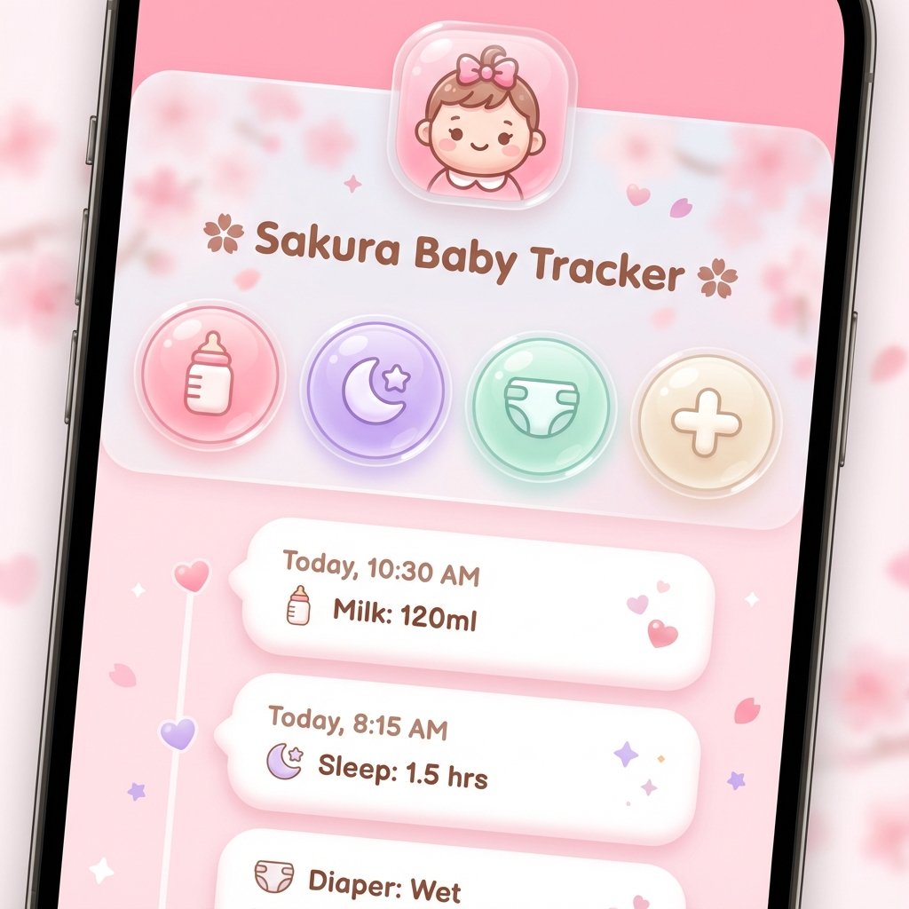
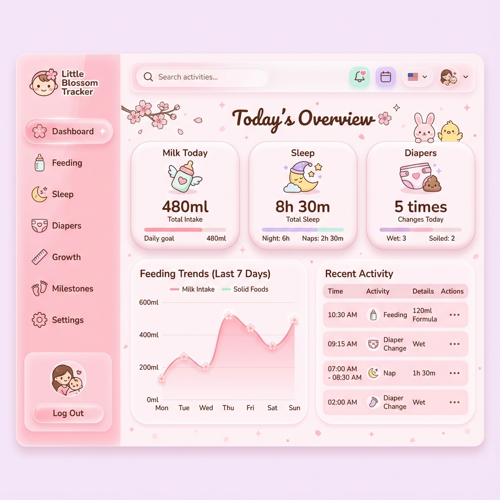

# BabyDaily UI/UX 设计规范与原型说明

## 1. 设计理念 (Design Philosophy)
- **关键词**: 甜美 (Sweet)、可爱 (Cute/Kawaii)、粉嫩 (Tender Pink)、通透 (Glass/Airy)。
- **适用场景**: 专为女宝宝设计的温馨界面。
- **风格**: 
    - **樱花粉色系**: 以粉色为主调，搭配暖白和奶油黄，营造满满的少女心和温馨感。
    - **圆润 Q 弹**: 所有按钮和卡片都使用极大的圆角 (Fully Rounded)，看起来像软糖一样。
    - **毛玻璃 (Glassmorphism)**: 这种通透感被保留，用于营造精致和现代的感觉。
    - **可爱插画**: 使用圆润可爱的线性图标或微插画。

## 2. 视觉规范 (Visual Identity)

### 2.1 配色方案 (Color Palette - Sakura Pink)
- **主色 (Primary)**: `#FFB7C5` (Sakura Pink) - 做按钮背景，甜美可爱。
- **辅助色**:
    - `#FFF0F5` (Lavender Blush) - 页面大背景，极淡的粉白。
    - `#FFDAB9` (Peach Puff) - 温暖的点缀。
    - `#E0FFFF` (Light Cyan) - 清新的对比色（如尿布记录）。
- **文字色**: `#8B4513` (Saddle Brown) - 用暖棕色代替黑色，更加柔和协调。

### 2.2 字体 & 形状
- 字体: 圆体 (Rounded)，避免尖锐笔画。
- 形状: 面性图标，气泡状按钮，全圆角卡片。

## 3. 核心界面原型说明 (Key Screens)

### 3.1 首页 / 仪表盘 (Home Dashboard)

- **顶部**: 
    - 背景是梦幻的粉色渐变 + 毛玻璃。
    - 可爱的女宝宝头像，周围有光晕。
- **功能区**:
    - "按压式"的软糖按钮，点击有 Q 弹效果。
    - 图标更加卡通化（例如奶瓶画个笑脸）。
- **时间轴**:
    - 使用虚线连接，每个节点都是一颗小爱心或小圆点。

### 3.2 记录页面 (Record Sheet)
- 延续粉色风格，数字键盘设计成计算器或电话拨号盘的可爱样式。

### 3.3 统计页面 (Statistics)
- 曲线使用柔和的粉色填充。

### 3.4 Web 管理后台 (Web Dashboard)

- **风格**: 延续小程序的樱花粉主题，但更加专业和大气。
- **侧边栏**: 粉色导航，圆角图标，选中项有光泽高亮。
- **统计卡片**: 棉花糖般的圆润卡片，显示今日喂奶量、睡眠时长等关键数据。
- **图表**: 粉色渐变的曲线图，展示趋势变化。
- **活动记录**: 干净的表格，无生硬边框，交替行使用极淡的粉色。

### 3.5 OOTD 宝宝穿搭相册 (Outfit of the Day)
- **功能**: 每日拍照记录宝宝穿搭，形成可爱的时尚日历和相册。
- **入口**: 首页快捷按钮或底部 Tabbar。
- **日历视图**: 
    - 顶部月份切换（如 "2024年12月"）。
    - 日历格子中显示当日穿搭缩略图，点击查看大图。
- **瀑布流相册**: 
    - 粉色背景，照片卡片像宝丽来一样圆润。
    - 可添加标签（公主裙、运动装）和备注。
- **拍照按钮**: 底部悬浮粉色相机按钮 "📷 记录今日穿搭"。
- **Web 端**: 网格布局展示所有 OOTD，支持按日期和标签筛选。
